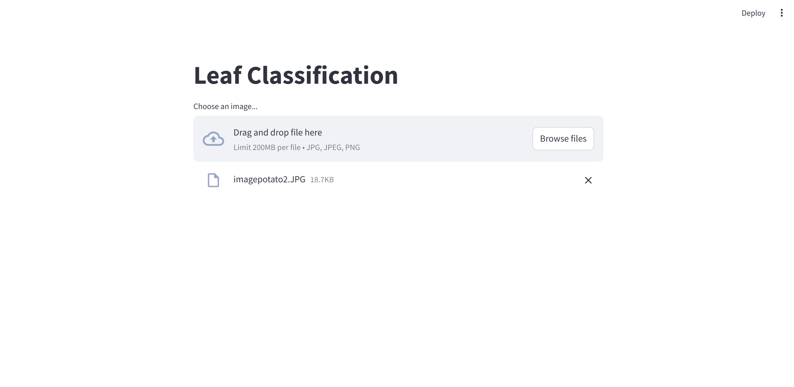

1. # Project Name

Potato Leaf Classifire

## Table of Contents

1. [Overview](#overview)
2. [Installation](#installation)
3. [Run](#run)


## Overview
The Potato Leaf Classifier is a deep learning project designed to identify and classify potato leaf diseases. This model helps in detecting the following classes:

Early Blight: A common potato disease caused by the fungus Alternaria solani.<br>
Late Blight: A serious disease of potatoes and tomatoes caused by the oomycete Phytophthora infestans.<br>
Healthy: Leaves without any visible disease symptoms.<br>
By accurately classifying these conditions, the model aims to aid farmers and agricultural experts in taking timely action to prevent crop damage.

## Installation

Step-by-step instructions on how to set up the environment and install the necessary dependencies.

```bash
# Clone the repository
git clone [ [https://github.com/username/repository-name.git](https://github.com/9650ro85hit/rohitsen_potato_leaf_classifire.git)](https://github.com/9650ro85hit/rohitsen_potato_leaf_classifire.git)

# Navigate into the project directory
cd repository-name

# Create a virtual environment (optional but recommended)
python -m venv venv
source venv/bin/activate  # On Windows use `venv\Scripts\activate`

# Install required packages
pip install -r requirements.txt


## run
After installation of all nessesary librearies..
Run steamlit run main.py in terminal.
You will get User Interface like 
```
# Upload an Image and press predict button to see the result..


[](leaf_classi_ui.PNG)

## You can See the results  with videos

[](WhatsApp Video 2024-07-20 at 11.52.32 AM.mp4)


